<picture>
  <source media="(prefers-color-scheme: dark)" srcset="./banner-animated-dark.svg">
  
</picture>

**RXSW** builds software and data systems: platforms, extraction pipelines and automation that turn messy sources into reliable information.

<code>▁█▂▇▃▆▄▅▄▄▄▄▄▄▄▄▄▄</code>

| Area | What we build |
|---|---|
| **Data extraction** | Routines and SDKs that collect, normalize and verify data from the web. |
| **Platforms** | Products and internal tools built on top of that data. |
| **Automation & infra** | Deployment, orchestration and the tooling that keeps it running. |

### How we work

`01` **Precise** — say exactly what it does, with numbers and units. 
`02` **Direct** — short sentences, verb first. 
`03` **Sober** — contrast, not decoration. 
`04` **Verifiable** — show the work: logs, versions, sources.

<code>▁█▂▇▃▆▄▅▄▄▄▄▄▄▄▄▄▄</code> &nbsp;Signal from the noise.
